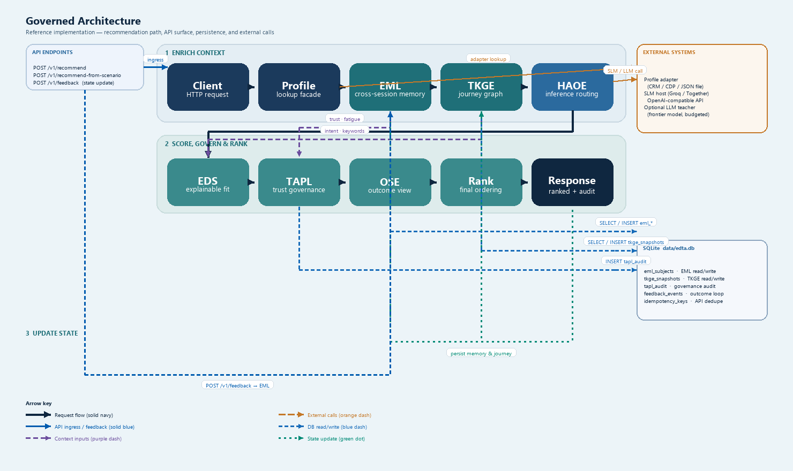

# Governed Architecture — Reference Implementation

Open-source reference for a **governed recommendation pipeline**: context enrichment, trust-aware ranking, and stateful journey memory — not a single black-box model.

**Live demo:** https://edta-api.onrender.com/scenario-demo  
**Swagger:** `/docs` on any running instance

---

## Pipeline overview

Every recommend request moves through three phases:

1. **Enrich context** — Client → Profile → EML → TKGE → HAOE  
2. **Score, govern & rank** — EDS → TAPL → OSE → Rank → Response  
3. **Update state** — persist memory & journey for the next request  



Solid arrows are request flow; dashed lines are context inputs and state feedback.

---

## Layers

| Layer | Role |
|-------|------|
| **Profile** | Lookup facade at the API boundary (pluggable CRM/CDP adapter) |
| **EML** | Cross-session memory — trust, fatigue, preferences, history (SQLite) |
| **TKGE** | Journey graph — temporal session context merged from prior snapshots |
| **HAOE** | Inference routing — Rules → SLM → ML → optional LLM |
| **EDS** | Explainable relevance score with reason codes |
| **TAPL** | Trust governance — show / soften / delay / suppress (modifies rank) |
| **OSE** | Outcome view — conversion, revenue, trust, and risk simulation |
| **Rank** | Hybrid final ordering |

Policies are externalized in YAML: `config/eml_policies.yaml`, `config/tapl_policies.yaml`, `config/haoe_policies.yaml`.

---

## Code entry points

| Path | Purpose |
|------|---------|
| `app/services/recommendation_handlers.py` | Request handler — enrich, rank, persist |
| `app/recommender.py` | Per-candidate scoring loop |
| `app/experience_memory.py` | EML facade |
| `app/context_graph.py` | TKGE graph builder |
| `app/orchestration.py` | HAOE tier routing |
| `app/eds.py` | EDS scoring |
| `app/ai/tapl_model.py` | TAPL governance |
| `app/ai/outcome_model.py` | OSE simulation |

---

## API response contract

`POST /v1/recommend` and `POST /v1/recommend-from-scenario` return `RecommendationResponseV1`:

```json
{
  "request_summary": {
    "request_id": "4060fd17-…",
    "experience_memory": { "before": { "trust_score": 0.65, "fatigue_score": 0.0 }, "after": { "…" } },
    "context_graph": { "inferred_intent": "upgrade", "journey_sequence": ["…"] },
    "inference": { "tier": "ml" }
  },
  "recommendations": [{
    "candidate": { "id": "large_family_suv" },
    "eds_score": { "final_eds_score": 0.79 },
    "ai_score": {
      "tapl": { "action": "show" },
      "outcome_simulation": { "expected_outcome_score": 0.44 }
    },
    "reason_codes": ["intent_match", "context_overlap:suv"]
  }]
}
```

Full schema: `/docs` · `app/api/schemas.py`, `app/models.py`.

---

## Travel benchmark (11 scenarios)

Pre-tuned travel profiles with distinct EDS, TAPL, and outcome scores — **11/11 vehicle match** in the reference corpus.

| Resource | Link |
|----------|------|
| **Score matrix (markdown)** | [benchmark/TRAVEL_SCENARIO_SCORES.md](benchmark/TRAVEL_SCENARIO_SCORES.md) |
| **Live interactive matrix** | https://edta-api.onrender.com/scenario-demo (Travel benchmark section) |
| **API** | `GET /travel-scenario-benchmark` (via demo proxy or with API key) |
| **Regenerate** | `python scripts/benchmark_travel_scenarios.py` |

---

## Security note

Never commit `.env`, API keys, or runtime databases (`data/edta.db`). Use `.env.example` as a template. Rotate any key that was ever stored outside your secret manager.
