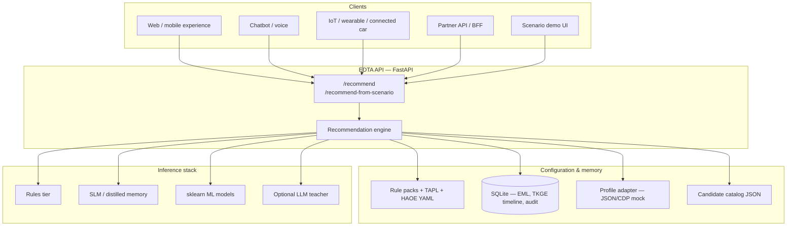
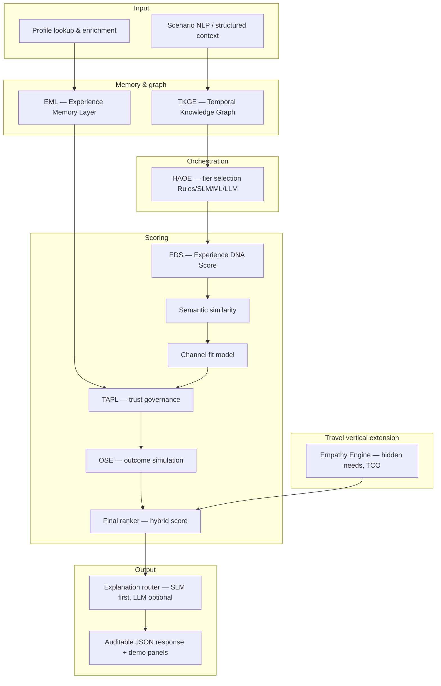
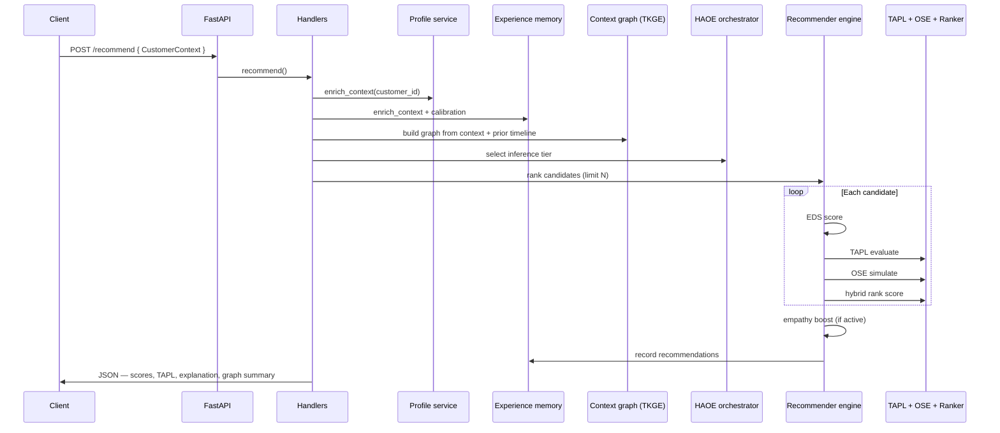
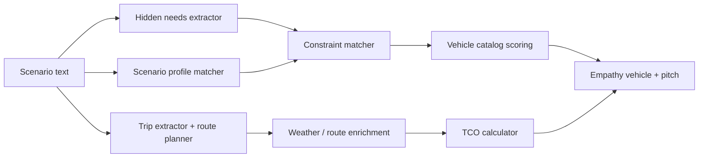
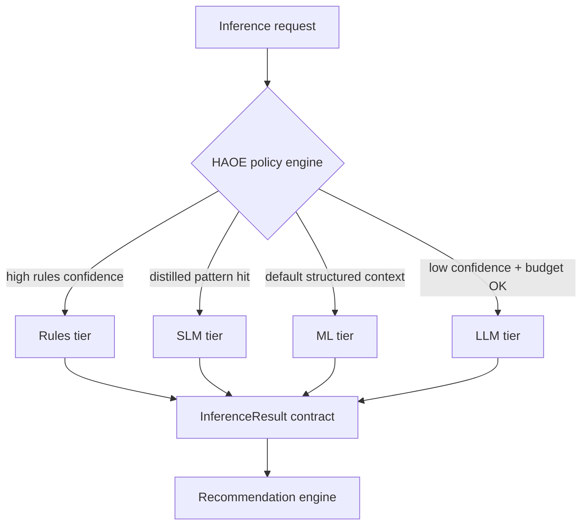

# EDTA — Architecture Document

**Experience-Driven Targeting Architecture for Governed, Explainable, Trust-Aware Personalization**

| Field | Value |
|-------|--------|
| **Author** | Jerald Selvaraj |
| **Purpose** | Architecture reference, technical review, and conference presentation |
| **Working title (InfoQ article)** | *Governed Personalization: Why Trust Must Change the Rank, Not Just the Log* |
| **Conference talk** | *Why Did We Show This? Designing Auditable Recommendation Systems* |
| **Technical title** | *Beyond LLM-First Recommendations: A Four-Tier Architecture for Trust-Aware Ranking* |
| **Live demo** | https://edta-api.onrender.com/scenario-demo |
| **GitHub** | https://github.com/jeraldcs/edta-complete-api |
| **Companion draft** | `docs/edta_llm_personalization_article_draft.md` |
| **Benchmark report** | `docs/TRAVEL_SCENARIO_SCORES.md` |
| **Status** | Architecture reference v1 — July 2026 |

---

## Table of contents

1. [Executive summary](#1-executive-summary)
2. [Problem statement](#2-problem-statement)
3. [System context](#3-system-context)
4. [Architecture overview](#4-architecture-overview)
5. [End-to-end request flow](#5-end-to-end-request-flow)
6. [Layer-by-layer design](#6-layer-by-layer-design)
7. [Empathy engine (travel vertical)](#7-empathy-engine-travel-vertical)
8. [Four-tier inference (HAOE)](#8-four-tier-inference-haoe)
9. [Why EDTA is unique](#9-why-edta-is-unique)
10. [Benefits for engineering and business](#10-benefits-for-engineering-and-business)
11. [Live demo walkthrough](#11-live-demo-walkthrough)
12. [GitHub repository guide](#12-github-repository-guide)
13. [Benchmarks and evidence](#13-benchmarks-and-evidence)
14. [Presentation outline (20 slides)](#14-presentation-outline-20-slides)
15. [Scope boundaries and honest limits](#15-scope-boundaries-and-honest-limits)
16. [Suggested publication package](#16-suggested-publication-package)

---

## 1. Executive summary

**EDTA (Experience-Driven Targeting Architecture)** is a reference implementation of enterprise personalization treated as a **governed decision pipeline**, not a single black-box model. It combines:

- A **Temporal Knowledge Graph Engine (TKGE)** for live journey context
- An **Experience Memory Layer (EML)** for trust, fatigue, and preference state
- A **Hybrid AI Orchestration Engine (HAOE)** with explicit **Rules → SLM → ML → LLM** tiers
- **Experience DNA Score (EDS)** for explainable relevance
- **Trust-Aware Personalization Layer (TAPL)** that affects ranking, not only logs
- **Outcome Simulation Engine (OSE)** for expected conversion and revenue impact
- An **Empathy Engine** for scenario-derived hidden needs, route enrichment, and TCO (travel demo)
- A **FastAPI** surface with auditable API contracts and a browser scenario demo

The LLM is optional: it enriches and explains; it does **not** own consent, compliance, fatigue, or final trust governance.

---

## 2. Problem statement

Most personalization stacks reduce to:

```text
context → model → ranked item
```

That fails enterprise requirements:

| Gap | Consequence |
|-----|-------------|
| Opaque ranking | Product and compliance cannot answer *why* |
| LLM-first design | Unbounded cost, latency, and provider dependency |
| Trust as metadata | Consent/fatigue logged but not enforced in ranking |
| Single-channel thinking | Web, chatbot, IoT, wearable need unified policy |
| No outcome view | Optimizes click-through, not expected business outcome |
| Weak explainability | No rules fired, tier, TAPL action, or score breakdown in API |

EDTA decomposes personalization into **testable modules** with explicit responsibilities and API-visible decisions.

---

## 3. System context

Who interacts with the system and what crosses the boundary:



**Deployment reference:** Render (`render.yaml`) hosts the public demo; Docker/local runs are used for latency benchmarks (see `docs/BENCHMARKS.md`).

---

## 4. Architecture overview

### 4.1 Logical layer stack



### 4.2 Acronym reference

| Acronym | Name | Role |
|---------|------|------|
| **TKGE** | Temporal Knowledge Graph Engine | Journey sequence, timeline, inferred intent from live + prior events |
| **EML** | Experience Memory Layer | Trust, fatigue, preferences, recommendation history per subject |
| **HAOE** | Hybrid AI Orchestration Engine | Selects Rules / SLM / ML / LLM tier by confidence and cost budget |
| **EDS** | Experience DNA Score | Explainable relevance: intent, engagement, journey, context, risk |
| **TAPL** | Trust-Aware Personalization Layer | show / soften / delay / suppress / generic_fallback |
| **OSE** | Outcome Simulation Engine | Conversion probability, revenue impact, expected outcome score |
| **SLM** | Small language model tier | Distilled pattern memory + optional endpoint + rules fallback |

---

## 5. End-to-end request flow

### 5.1 Structured API path (`POST /recommend`)



### 5.2 Free-text demo path (`POST /recommend-from-scenario`)

Used by the live scenario demo and travel benchmark:

```text
scenario_text
  → ScenarioNLPParser (keyword heuristics ± optional LLM)
  → scenario_anonymous_id() — isolate EML/TKGE per trained profile
  → ProfileLookupService + EML enrich
  → EmpathyEngine.process() — hidden needs, profiles, TCO, constraints
  → merge vehicle catalog candidates
  → RecommendationEngine.recommend()
  → attach empathy vehicle + architecture panels
  → return RecommendationResponse
```

**Key code entry:** `app/services/recommendation_handlers.py` → `recommend_from_scenario()`.

---

## 6. Layer-by-layer design

### 6.1 Scenario NLP and data contract

**Purpose:** Convert free-text or structured payloads into a canonical `CustomerContext`.

**Implementation:** `app/scenario_nlp.py`, `app/models.py`

**Extracts:**

- Channel (web, mobile, chatbot, IoT, wearable, connected car)
- Intent (research, purchase, support, retention, upgrade)
- Journey stage (research, consideration, purchase, service)
- Consent flags (personalization, profile lookup)
- Profile hints (loyalty tier, fatigue count, trust score)
- Session events and search terms

**Advantage:** Same API serves anonymous and known users across channels without rewriting the engine.

**Unique detail:** Parser confidence is estimated and exposed in the response for HAOE tier routing.

---

### 6.2 Profile lookup (known-user enrichment)

**Purpose:** Merge CRM/CDP/loyalty data before scoring.

**Implementation:** `app/profile_service.py`, `app/profile/adapters/json_file.py`

**Design principle:** Identity resolution stays **outside** the recommender. The engine receives an enriched context only.

**Demo data:** `cust-789` — preferred loyalty, SFO, family traveler (`data/profiles.json` or equivalent).

**Production path:** Swap JSON adapter for HTTP CDP client without changing ranking code.

---

### 6.3 TKGE — Temporal Knowledge Graph Engine

**Purpose:** Represent the visitor’s journey as a temporal graph for inference and explainability.

**Implementation:** `app/context_graph.py`, persisted timeline via `app/graph_store.py`

**Builds:**

- Nodes: channel, intent, journey, profile attributes, session events, keywords
- Temporal edges with recency weighting (72-hour half-life default)
- `live_journey_sequence` — events from the current run
- `inferred_intent` / `next_best_journey_stage` — graph-derived signals
- Per-scenario isolation: `anonymous:travel-winter_mountain_denver`, etc.

**Advantage:** Repeat visits accumulate timeline context; demo scenarios do not overwrite each other’s graph state.

**API exposure:** `request_summary.context_graph` — node/edge counts, journey sequence, recent outcomes.

---

### 6.4 EML — Experience Memory Layer

**Purpose:** Persistent trust, fatigue, preferences, and outcome history per subject.

**Implementation:** `app/experience_memory.py`, `app/eml_store.py`, SQLite tables `eml_subjects`, `eml_outcomes`, `eml_recommendation_history`

**Influences:**

- TAPL `trust_score` and `fatigue_score` inputs
- OSE calibration (`historical_cvr`, `avg_revenue_per_impression`)
- Preference adjustments in ranking

**Advantage:** Personalization improves over sessions; fatigue actually reduces aggressiveness (via TAPL delay/suppress).

**Demo panels:** EML card shows trust/fatigue before → after each run.

---

### 6.5 EDS — Experience DNA Score

**Purpose:** Explainable relevance score before ML ranker fusion.

**Implementation:** `app/eds.py`

**Components:**

| Component | Meaning |
|-----------|---------|
| `intent_score` | Candidate intent tag match |
| `engagement_score` | Session events + search terms |
| `business_value_score` | Margin, inventory, business value weights |
| `journey_momentum_score` | Journey stage tag match |
| `context_relevance_score` | TKGE keyword overlap with candidate tags |
| `risk_adjustment` | Consent missing or high compliance sensitivity |

**Formula (conceptual):**

```text
final_eds = weighted_sum(intent, engagement, business, journey, context) − risk_adjustment
```

**Advantage:** Every recommendation returns **human-readable reason codes** (`intent_match`, `context_overlap:suv`, etc.).

---

### 6.6 TAPL — Trust-Aware Personalization Layer

**Purpose:** Govern **whether** and **how** to show a recommendation.

**Implementation:** `app/ai/tapl_model.py`, `app/tapl_policy.py`, `config/tapl_policies.yaml`, `app/tapl_audit.py`

**Inputs:** consent, EML trust, fatigue, channel, candidate compliance sensitivity

**Actions:**

| Action | Effect on ranking |
|--------|-------------------|
| `show` | Full hybrid score |
| `soften` | Score × 0.85 |
| `delay` | Score × 0.55 |
| `suppress` / `generic_fallback` | Cap score at 0.15 |

**Policy overrides (YAML):**

- No personalization consent → `generic_fallback`
- Fatigue ≥ threshold → `delay`
- Sensitive channel + high compliance content → `suppress`

**Advantage:** Trust governance is **first-class in ranking**, with SQLite audit trail — not a post-hoc flag.

**Why unique:** Most recommenders treat trust/compliance as filters or logs; TAPL is a scored decision with explainable reason strings in the API.

---

### 6.7 OSE — Outcome Simulation Engine

**Purpose:** Estimate business outcome beyond immediate click probability.

**Implementation:** `app/ai/outcome_model.py`

**Outputs:**

- `conversion_probability`
- `revenue_impact`
- `trust_impact`, `journey_impact`, `compliance_risk`, `fatigue_risk`
- `expected_outcome_score` — composite for ranker

**Calibration:** Blends ML prediction with heuristics when models saturate; applies EML historical CVR when available.

**Advantage:** Product can compare candidates on **expected outcome**, not only semantic similarity.

---

### 6.8 Final ranker and empathy boost

**Implementation:** `app/ai/ranker_model.py`, `app/recommender.py`

**Hybrid score inputs:** EDS, semantic similarity, channel fit, TAPL trust, OSE expected outcome, business value, compliance penalty, fatigue penalty.

**Empathy boost (travel):** When trained profile constraints match, empathy match score adds weighted boost; preferred profile vehicle gets additional boost.

**Returned fields:**

- `ai_rank_score` — base rank before TAPL action cap
- `final_hybrid_score` — after TAPL and empathy adjustments

---

### 6.9 Explanation router

**Purpose:** Generate human-readable rationale without always calling an LLM.

**Implementation:** `app/inference/explanation_router.py`, `app/llm/slm_client.py`, `app/llm/llm_client.py`

**Order:** SLM / local template first → LLM escalation if enabled and budget allows.

**API field:** `explanation_source` — `local`, `local_fallback`, `slm`, `llm`.

---

## 7. Empathy engine (travel vertical)

Travel is the **primary demo vertical** with 11 trained scenarios (cust-789 + 10 road-trip archetypes).



### 7.1 Components

| Module | File | Function |
|--------|------|----------|
| Hidden needs | `app/empathy/hidden_needs.py` | Rule patterns (mountain, toddler family, etc.) with word-boundary matching |
| Profile matcher | `app/empathy/scenario_profiles.py` | 11 YAML profiles — keywords, persona, preferred vehicle, scoring hints |
| Trained corpus | `config/empathy/trained_scenarios.yaml` | Canonical scenario texts for tests and benchmark |
| Constraint matcher | `app/empathy/constraint_matcher.py` | Maps constraints → vehicle specs (AWD, ISOFIX, EV, etc.) |
| TCO | `app/empathy/tco_calculator.py` | Rental + fuel trip cost comparisons |
| Orchestration | `app/empathy/service.py` | Wires empathy into `CustomerContext.business_context` |

### 7.2 Trained travel scenarios (benchmark matrix)

| # | Profile | Expected vehicle | Example objective |
|---|---------|------------------|-------------------|
| 0 | `loyalty_family_rental` | family_friendly_suv | cust-789 SFO family SUV rental |
| 1 | `winter_mountain_denver` | awd_suv | Winter Denver 500-mile mountain trip |
| 2 | `long_family_vacation` | large_family_suv | NJ → Orlando, family of five |
| 3 | `business_executive` | luxury_sedan | 35k annual business miles |
| 4 | `national_park_adventure` | awd_suv | Yellowstone / Glacier multi-park |
| 5 | `urban_commuter` | hybrid_midsize | 18k urban commute miles |
| 6 | `electric_vehicle` | electric_midsize | First EV, home charging |
| 7 | `luxury_winter_suv` | premium_suv | Colorado luxury winter SUV |
| 8 | `first_time_driver` | economy_compact | New driver, suburban |
| 9 | `rental_seattle_vacation` | awd_suv | Seattle 7-day rental vacation |
| 10 | `wet_weather_hurricane` | awd_suv | Hurricane season Southeast trip |

Full scored matrix: `docs/TRAVEL_SCENARIO_SCORES.md` (regenerate: `python scripts/benchmark_travel_scenarios.py`).

---

## 8. Four-tier inference (HAOE)



**Implementation:** `app/orchestration.py`, `app/haoe_policy.py`, `config/haoe_policies.yaml`

**Public tiers:** `rules`, `slm`, `ml`, `llm` — each returns tier, confidence, rules fired, cost units, latency estimate.

**Cost control:** Session cost budget, LLM circuit breaker, explanation router prefers SLM.

**Benchmark:** `scripts/load_test_tiers.py`, `docs/BENCHMARKS.md` — tier match rate, fallback rate, latency, cost units.

---

## 9. Why EDTA is unique

Comparison against common patterns:

| Pattern | Typical approach | EDTA difference |
|---------|------------------|-----------------|
| **LLM-first personalization** | One prompt → recommendation | LLM is optional teacher; governance stays in TAPL + rules |
| **Monolithic ranker** | Single model score | EDS + TAPL + OSE + ranker — each auditable |
| **Trust as logging** | Trust score in analytics only | TAPL modifies rank and action |
| **Hidden routing** | Ad hoc if/else for model choice | HAOE with YAML policy + `InferenceResult` contract |
| **Stateless API** | Each request independent | EML + TKGE timeline across sessions |
| **Black-box explainability** | SHAP post-hoc | Rules fired, reason codes, tier, TAPL reason in JSON |
| **Vertical rewrite** | New engine per industry | Same core; swap YAML rules, TAPL, catalog, empathy profiles |
| **Travel recommender** | Filter by category | Empathy hidden needs + constraints + TCO + trained scenario profiles |

**Technical summary:** A **governed, multi-tier, memory-aware personalization pipeline** with **API-native explainability** — implemented as open reference code, not slides-only architecture.

---

## 10. Benefits for engineering and business

### 10.1 Engineering

- **Testability:** 149+ pytest cases; tier benchmarks; 11-scenario travel matrix with 100% vehicle alignment
- **Modularity:** Swap profile adapter, rule packs, or catalog without touching ranker
- **Graceful degradation:** LLM off → ML/rules; ML missing → heuristics
- **Observability:** Structured logs, audit tables, `/health`, metrics hooks
- **CI-friendly contracts:** OpenAPI + stable `request_summary` shape

### 10.2 Product and compliance

- Answer *why this offer, why now, why this channel*
- Demonstrate consent and fatigue handling (TAPL delay/suppress demos)
- Compare outcomes before A/B tests (OSE simulation)
- Healthcare scope: HCP education routing with suppress on sensitive channels — **not** clinical decision support

### 10.3 Business (travel vertical)

- Journey-aware upsell (research → booking)
- Loyalty-aware trust scores (cust-789 preferred tier)
- Vehicle-fit via empathy constraints (AWD winter, family cargo, EV range)
- TCO-aware pitches for cost-sensitive travelers

---

## 11. Live demo walkthrough

**URL:** https://edta-api.onrender.com/scenario-demo

### 11.1 Demo UI sections

| Section | What it shows |
|---------|----------------|
| **Scenario input + Recommend** | Free-text → `POST /recommend-from-scenario` |
| **Recommendation result** | Top candidate, hybrid score, TAPL action, empathy badge |
| **Parsed NLP context** | Channel, intent, journey, parser confidence |
| **Empathy panels** | Hidden needs, weather/terrain, TCO, empathy pitch |
| **Architecture panels** | TKGE, EML, HAOE, OSE, TAPL per run |
| **Technical explanation** | NLP → filtering → scoring → TAPL → empathy |
| **API request/response** | Raw JSON for integrators and reviewers |
| **Travel benchmark table** | All 11 trained scenarios with EDS, outcome, trust, rank scores |

### 11.2 Suggested live demo script (5 minutes)

1. **Default scenario (cust-789)** — loyalty family SUV, SFO, consent true  
   → Show `loyalty_family_rental` profile, high trust (~0.92), no false toddler constraints.

2. **Winter Denver scenario** — paste Scenario 1 text  
   → `awd_suv`, mountain constraints, TKGE journey includes denver keywords.

3. **Consent false variant** — add “personalization consent false”  
   → TAPL `generic_fallback`, lower effective rank.

4. **High fatigue variant** — “fatigue count 8, many ads”  
   → TAPL `delay`, fatigue ≥ 0.7.

5. **Scroll to benchmark table** — show 11 scenarios with distinct trust/fatigue/outcome scores.

### 11.3 Demo technical reliability features

- Inline `window.__EDTA_DEMO_CONFIG__` — API key without race
- Cache-busted JS assets — avoids stale Recommend button bugs
- Form submit handler — reliable POST on click
- `GET /travel-scenario-benchmark` — precomputed matrix for table

---

## 12. GitHub repository guide

**Repository:** https://github.com/jeraldcs/edta-complete-api

### 12.1 Top-level layout

```text
edta-complete-api/
├── app/                    # FastAPI application core
├── config/                 # YAML — rules, TAPL, HAOE, empathy profiles
├── data/                   # Catalog, profiles, generated benchmarks
├── docs/                   # Article drafts, architecture, benchmarks
├── models/                 # Trained sklearn joblib models
├── scripts/                # Train, benchmark, smoke test
├── static/                 # Scenario demo UI (HTML/JS/CSS)
├── tests/                  # pytest suite (149+ tests)
├── render.yaml             # Hosted demo deployment
└── requirements.txt
```

### 12.2 Core application map (`app/`)

| Path | Responsibility |
|------|----------------|
| `main.py` | FastAPI routes, static mount, `/scenario-demo`, `/travel-scenario-benchmark` |
| `container.py` | Service wiring — engine, empathy, EML, parser |
| `models.py` | Pydantic contracts — CustomerContext, TAPL, OSE, responses |
| `recommender.py` | Main ranking loop — EDS, TAPL, OSE, empathy boost |
| `scenario_nlp.py` | Free-text scenario parser |
| `context_graph.py` | TKGE graph build + summary |
| `experience_memory.py` / `eml_store.py` | EML persistence |
| `orchestration.py` | HAOE tier selection |
| `eds.py` | Experience DNA Score |
| `services/recommendation_handlers.py` | Route handlers — recommend, scenario, benchmark |
| `services/travel_benchmark.py` | 11-scenario score extraction |
| `empathy/service.py` | Empathy engine orchestration |
| `empathy/scenario_profiles.py` | Trained profile matcher + scoring hints |
| `empathy/trained_scenarios.py` | Loads canonical scenario corpus |
| `ai/tapl_model.py` | TAPL classifier + policy merge |
| `ai/outcome_model.py` | OSE simulation |
| `ai/ranker_model.py` | Final hybrid ranker |
| `inference/explanation_router.py` | SLM-first explanations |
| `demo_html.py` | Server-rendered demo page with inline config |

### 12.3 Configuration map (`config/`)

| File | Purpose |
|------|---------|
| `empathy/scenario_profiles.yaml` | 11 travel profiles — keywords, vehicles, constraints, scoring |
| `empathy/trained_scenarios.yaml` | Full scenario texts for benchmark/tests |
| `empathy/hidden_needs.yaml` | Empathy rule patterns |
| `tapl_policies.yaml` | Consent, fatigue, sensitive channel rules |
| `haoe_policies.yaml` | Tier costs, latency, circuit breaker |
| `rules/*.yaml` | Domain rule packs (travel, healthcare, etc.) |

### 12.4 Key API endpoints

| Method | Path | Auth | Purpose |
|--------|------|------|---------|
| POST | `/recommend-from-scenario` | API key | Demo + free-text scenarios |
| POST | `/recommend` | API key | Structured CustomerContext |
| GET | `/scenario-demo` | No | Browser demo UI |
| GET | `/travel-scenario-benchmark` | No | 11-scenario score matrix JSON |
| GET | `/health` | No | Liveness + dependency checks |
| GET | `/docs` | No | OpenAPI Swagger |

### 12.5 How to run locally

```bash
pip install -r requirements.txt
python scripts/train_all_models.py    # optional — models included
uvicorn app.main:app --reload
# Demo: http://localhost:8000/scenario-demo
# Benchmark: python scripts/benchmark_travel_scenarios.py
pytest
```

---

## 13. Benchmarks and evidence

### 13.1 Travel scenario matrix (July 2026)

See `docs/TRAVEL_SCENARIO_SCORES.md` — **11/11 vehicle match (100%)**, distinct trust/fatigue/outcome per profile.

### 13.2 Four-tier benchmarks

See `docs/BENCHMARKS.md` — tier routing fidelity, latency tiers, cost units, fallback rates.

### 13.3 Test suite

```bash
pytest   # 149+ passed — API contracts, TAPL, empathy, trained scenarios, demo UI
```

**Not claimed without partner data:** Production A/B conversion lift or Netflix-scale generalization.

---

## 14. Presentation outline (20 slides)

Use this outline for a webinar or conference talk:

| Slide | Title | Content |
|-------|-------|---------|
| 1 | Title | Why Did We Show This? Designing Auditable Recommendation Systems — author, demo URL |
| 2 | The problem | Opaque rankers, LLM cost, trust as logging |
| 3 | Design principle | Pipeline not model; governance first |
| 4 | System context | Channels → API → memory → tiers |
| 5 | Architecture stack | TKGE, EML, HAOE, EDS, TAPL, OSE diagram |
| 6 | Data contract | CustomerContext walkthrough |
| 7 | TKGE | Journey timeline, per-scenario subjects |
| 8 | EML | Trust, fatigue, calibration |
| 9 | HAOE | Four tiers, cost budget, circuit breaker |
| 10 | EDS | Explainable score components |
| 11 | TAPL | Actions that change rank + audit |
| 12 | OSE | Outcome simulation |
| 13 | Empathy engine | Travel hidden needs + 11 scenarios |
| 14 | Live demo | cust-789 → winter Denver → TAPL variants |
| 15 | Benchmark table | 11 scenarios, distinct scores |
| 16 | GitHub tour | Repo map, key files, run locally |
| 17 | Healthcare angle | HCP education, suppress — scope limits |
| 18 | vs alternatives | Table from Section 9 |
| 19 | Lessons learned | ML saturation, empathy/top rank alignment, word-boundary rules |
| 20 | Q&A | Links: GitHub, demo, docs |

**Speaker notes for slide 14:** Hard-refresh demo; click Recommend; scroll architecture panels; open benchmark table at bottom.

---

## 15. Scope boundaries and honest limits

State clearly in any publication submission:

1. **Reference implementation** — demonstration corpus, not production traffic at scale.
2. **ML models** — sklearn on synthetic/generated training data; heuristic blend when models saturate.
3. **Healthcare** — approved HCP **education/content routing** only; not clinical decision support.
4. **Empathy** — rule + profile based for travel demo; not a replacement for full NLP/LLM extraction at scale.
5. **Hosted latency** — Render cold starts affect demo; engine benchmarks use Docker/local.

Honest limits increase credibility with technical reviewers.

---

## 16. Suggested publication package

Attach or link:

| Artifact | Path |
|----------|------|
| **Publication document (primary)** | `docs/EDTA_PUBLICATION_DOCUMENT.md` |
| **Word export with diagrams** | `docs/EDTA_PUBLICATION_DOCUMENT.docx` |
| Article draft (narrative) | `docs/edta_llm_personalization_article_draft.md` |
| This architecture document | `docs/EDTA_ARCHITECTURE_DOCUMENT.md` |
| Architecture Word export | `docs/EDTA_ARCHITECTURE_DOCUMENT.docx` |
| Positioning / cover note | `docs/EDTA_POSITIONING.md` |
| Architecture PDF (3 pages) | `docs/edta_architecture_diagram.pdf` |
| Travel benchmark | `docs/TRAVEL_SCENARIO_SCORES.md` |
| Four-tier benchmarks | `docs/BENCHMARKS.md` |
| Live demo | https://edta-api.onrender.com/scenario-demo |
| Source code | https://github.com/jeraldcs/edta-complete-api |

**Suggested editor summary (50 words):**

> EDTA is an open reference architecture for governed personalization: explicit Rules/SLM/ML/LLM tiers, trust-aware ranking (TAPL), outcome simulation, and API-native explainability. A live travel demo runs eleven trained road-trip scenarios with auditable scores. LLMs enrich and explain; they do not own consent or compliance.

---

## Appendix A — Architecture diagram (ASCII)

For slides or PDF export when Mermaid is unavailable:

```text
┌─────────────────────────────────────────────────────────────────┐
│                     Channel clients & demo UI                    │
└────────────────────────────┬────────────────────────────────────┘
                             │ HTTPS
┌────────────────────────────▼────────────────────────────────────┐
│                      FastAPI (app/main.py)                       │
│   /recommend  /recommend-from-scenario  /travel-scenario-benchmark│
└────────────────────────────┬────────────────────────────────────┘
                             │
┌────────────────────────────▼────────────────────────────────────┐
│              RecommendationHandlers + RecommendationEngine         │
│  ┌─────────┐ ┌─────────┐ ┌──────────┐ ┌───────┐ ┌──────┐ ┌─────┐ │
│  │Scenario │ │ Profile │ │  TKGE    │ │ EML   │ │HAOE  │ │Empathy│
│  │  NLP    │ │ lookup  │ │ context  │ │memory │ │tier  │ │engine│
│  └────┬────┘ └────┬────┘ └────┬─────┘ └───┬───┘ └──┬───┘ └──┬──┘ │
│       └───────────┴───────────┴───────────┴────────┴────────┘   │
│                             │                                      │
│       EDS → Semantic → Channel fit → TAPL → OSE → Ranker        │
│                             │                                      │
│                    Explanation router → JSON response              │
└─────────────────────────────────────────────────────────────────┘
                             │
┌────────────────────────────▼────────────────────────────────────┐
│ SQLite (EML, TKGE timeline, TAPL audit) + YAML policies + catalog │
└─────────────────────────────────────────────────────────────────┘
```

---

## Appendix B — Related documents in this repo

- `docs/edta_llm_personalization_article_draft.md` — prose article draft
- `docs/EDTA_POSITIONING.md` — lead paragraph and vertical angles
- `docs/EMPATHY_ENGINE_ROADMAP.md` — empathy engine evolution
- `docs/ai_model_design.md` — ML model feature design
- `docs/DEPLOYMENT.md` / `docs/RENDER.md` — hosting
- `docs/SECURITY.md` — API key and error exposure policies

---

*Document prepared for technical publication and presentation — EDTA reference implementation, Jerald Selvaraj.*
